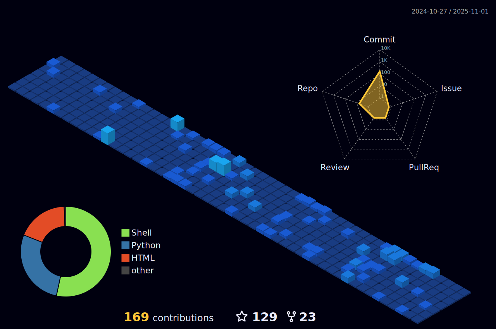

## 💡 About

Hi! Here is iaGuoZhi. I mainly focus on operating systems and system virtualization. Currently I'm a master student at [IPADS](https://ipads.se.sjtu.edu.cn/). I am expected to graduate from SJTU at Spring 2024.

WeChat ID: `echo -n 'RzE4NjIxODEzMjY4Cg==' | base64 -d`

## 📊 Stats

          

<!---

--->

